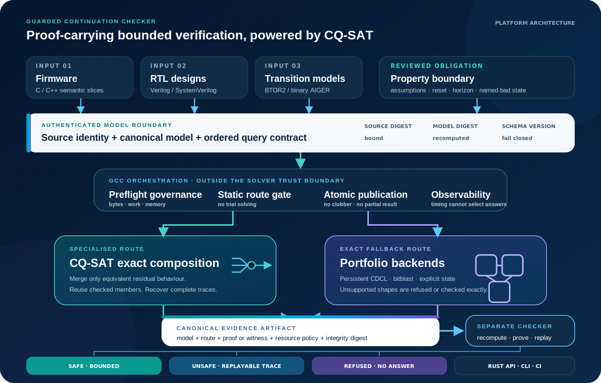

<p align="center">
  
</p>

<p align="center">
  <a href="https://github.com/kabudu/guarded-continuation-checker/actions/workflows/ci.yml?query=branch%3Amaster"></a>
  <a href="https://crates.io/crates/guarded-continuation-checker"></a>
  <a href="https://docs.rs/guarded-continuation-checker"></a>
  <a href="https://github.com/kabudu/guarded-continuation-checker/blob/master/Cargo.toml"></a>
  <a href="https://github.com/kabudu/guarded-continuation-checker/blob/master/LICENSE"></a>
  <a href="https://www.guardedcontinuation.org"></a>
</p>

# Guarded Continuation Checker

**Guarded Continuation Checker, powered by CQ-SAT**, is an evaluation-ready,
proof-carrying bounded verification platform for embedded firmware and RTL.

Guarded Continuation Checker (GCC) is the umbrella product and workflow. CQ-SAT
is its exact continuation-quotient engine: a calibration-free specialised
backend with persistent-CDCL fallback outside its validated structural regime.
The Rust package, library and executable use the product name:
`guarded-continuation-checker` on the command line and
`guarded_continuation_checker` in Rust source. See the
[brand and naming system](docs/BRAND.md).

The method processes variables in a fixed order, canonicalizes the residual CNF
after each Boolean choice, and merges prefixes only when their residual formulas
are exactly identical. A representative path is retained so satisfiable terminal
states reconstruct complete assignments.

## Status

This is an evaluation-ready research prototype, not a production-qualified or
certified product, not a general-purpose replacement for CDCL SAT solvers, and
not evidence that P = NP.

The project does not currently claim production readiness or scholarly novelty.
Those higher bars are tracked explicitly in the
[production-readiness](docs/PRODUCTION_READINESS_GAP.md) and
[novelty](docs/NOVELTY_GAP.md) gap registers.

## Platform architecture

Guarded Continuation Checker authenticates a bounded model and reviewed
obligation, governs the complete workload before solving, and selects CQ-SAT
only when a static structural gate admits it. Supported cases outside that
regime remain on an exact portfolio backend. Both routes publish canonical
evidence for a separate checker; resource refusal publishes no logical answer.

<p align="center">
  <a href="docs/ARCHITECTURE.md">
    
  </a>
</p>

The [architecture boundary and trust model](docs/ARCHITECTURE.md) explain what
each stage proves, what remains outside the claim, and why `REFUSED` is distinct
from both `SAFE` and `UNSAFE`.

The first release line now has a frozen
[production support profile](docs/PRODUCTION_SUPPORT_PROFILE_V1.md): firmware
CLI contract v2 and RTL artifact schema v4 only. A separately profiled build
rejects all research commands before dispatch, allowing release qualification
to proceed without freezing or shipping every experimental interface as a
supported product capability.

The experimental [controller MTBDD plant CLI v1](docs/CONTROLLER_MTBDD_CLI_V1.md)
provides a self-service producer and independent verifier for one public
controller composed with an ordered plant-property batch. Its canonical
manifest, exact query binding, stable per-member results, no-clobber output and
hostile-input controls close a local integration gap. Independent acceptance,
tagged compatibility and general partner source-to-model attestation remain
open; the pinned public controller and physical plant now have deterministic
local provenance evidence.
Rust callers can use `ControllerMtbddTool` for capability discovery, bounded
shell-free production and verification, typed batch and member results, and
invocation metrics without parsing command output.
The experimental
[split-evidence CLI v1](docs/CONTROLLER_SPLIT_EVIDENCE_CLI_V1.md) separates one
proof-carrying controller artifact from replaceable plant-result batches. Its
multi-batch verifier admits the controller proof once per process, checks every
controller and obligation binding, and emits per-batch plus aggregate results.
Rust callers can use `ControllerSplitEvidenceTool` for strict capability
discovery, shell-free bounded artifact production, one-process multi-batch
verification, reconciled typed summaries, and invocation metrics. Caller-selected
resource policies now govern both per-batch and complete-set work through the
file CLI and `ControllerSplitResourceTool`. Tagged compatibility and independent
acceptance remain open. Retained public washing-controller acceptance freezes
the first two split manifest and artifact compatibility fingerprints.
The first [governed split process-resource baseline](docs/CONTROLLER_SPLIT_PROCESS_RESOURCES_V1.md)
separates controller certification, each replaceable plant result, and
one-admission governed verification. Three Darwin arm64 trials retain exact
answers, evidence sizes, wall time, and peak RSS, while Linux CI validates the
same operation set without pretending host-dependent measurements are
byte-reproducible. This is operational evidence, not a speed or production
claim. Hosted run 29778509796 retains the corresponding Linux x86_64 rows with
identical evidence sizes and answers.
The [compatibility and migration policy](docs/COMPATIBILITY_AND_MIGRATION.md)
defines contract-version semantics, a two-minor-release and 12-month minimum
support window beginning with the first production tag, fail-closed version
handling, immutable upgrade and rollback procedures, and an executable split-v1
baseline. The current candidate establishes the baseline only; cross-tag
history and registry SemVer evidence remain open.
The typed clients also expose a bounded
[process-client observability aggregate](docs/PROCESS_CLIENT_OBSERVABILITY_V1.md)
and [governed split phase metrics](docs/CONTROLLER_SPLIT_OBSERVABILITY_V1.md),
with an additive
[allocation-event contract](docs/CONTROLLER_SPLIT_ALLOCATION_OBSERVABILITY_V1.md).
The additive
[cache-observability contract](docs/CONTROLLER_SPLIT_CACHE_OBSERVABILITY_V1.md)
permits process-local semantic replay reuse only after complete integrity
preflight.
It preserves successful and failed jobs, checked timing and stream totals,
containment coverage, operation counts, and failure-class counts in canonical
CSV. A real governed split integration test retains discovery, verification,
and resource refusal in one three-job aggregate. The additive observed split
path reports reconciled phase durations and structural work counters only after
a complete success. After fixture setup, six observed-contract invocations
aggregate four retained verified batches, exercise one duplicate-batch cache
hit, and prove that a resource refusal emits no partial metrics. The
allocation-observed path also validates positive
system-allocator event counts without treating them as live heap or portable
performance evidence. Cache lookup, hit, miss, and entry counters reconcile
against the batch set, including a retained duplicate-batch hit probe.
The [static MTBDD plant portfolio](docs/CONTROLLER_MTBDD_PLANT_PORTFOLIO_V1.md)
now selects the reusable MTBDD path when its frozen structural limits admit the
controller, and otherwise preserves the identical bounded query through direct
exact evaluation through both Rust and file interfaces. Only three explicit
resource-limit rejections permit fallback; malformed models, semantic errors,
query drift, and forced downgrades fail closed.
The experimental
[verification resource envelope v1](docs/CONTROLLER_PLANT_RESOURCE_ENVELOPE_V1.md)
adds caller-selected artifact, batch, horizon, product-state, and conservative
transition bounds to the public Rust verifier. It refuses excess work before
semantic replay without turning a refusal into a verification answer. A
canonical policy CLI and typed process client now expose the same boundary for
self-service integrations. Resource refusals use a versioned reason, exit code
3, and no logical answer, while malformed input remains a tool error. Linux
enforcement now covers a typed direct-exact regression and every governed job
in the release-build acceptance pipeline under a 64 MiB address-space ceiling.
The [hosted Linux run](https://github.com/kabudu/guarded-continuation-checker/actions/runs/29750776535)
reproduces the governed pipeline. That ceiling is not an RSS measurement.
Independent constrained acceptance is still open.
The retained six-job acceptance pipeline aggregates two verified batches, two
valid refusals, and two invalid-input controls without dropping any row or
inventing a logical answer for rejected work. This is simulated self-service
evidence, not independent partner acceptance.
The first experimental
[governed proof-carrying MTBDD slice](docs/GOVERNED_PROOF_MTBDD_PORTFOLIO_V1.md)
extends the Rust resource boundary to the equivalence artifact and embedded
UNSAT proof while preserving zero exhaustive controller assignments. A
canonical policy CLI and typed bounded process client expose the same contract
with seven stable refusal reasons and no answer on refusal. Portfolio routing
now has a first Rust API that selects proof-carrying MTBDD only after static
admission and otherwise preserves the exact direct query. File/process
portfolio commands and a typed bounded process client now cover capability
discovery and governed verification for both the proof and exact fallback
routes. A deterministic six-job acceptance pipeline now passes the pinned public
washing-controller batch and the exact fallback under Linux process limits.
The pinned controller and physical-plant AIGER files now also have
[deterministic source-to-model attestation](docs/SOURCE_MODEL_ATTESTATION_V1.md)
through their exact Yosys revision and synthesis recipes. Attestation can now
be made mandatory in the governed proof-portfolio invocation, including through
a typed Rust client. This prevents a valid portfolio result from being accepted
against substituted controller or plant model bytes. General project
provenance and compatibility gates remain open.
Its [phase baseline](docs/CONTROLLER_PLANT_PORTFOLIO_PHASES_V1.md) shows that
semantic replay, rather than model loading, dominates the admitted public
workflow. Phase observations remain excluded from routing decisions.
The follow-up [equivalence-proof experiment](docs/CONTROLLER_MTBDD_EQUIVALENCE_PROOF_V1.md)
replaces exhaustive controller replay with a source-bound UNSAT miter proof.
Its separate [proof-carrying CLI v1](docs/CONTROLLER_PROOF_MTBDD_CLI_V1.md)
provides create-new file workflows and a typed, bounded Rust process client
without changing the compact CLI contract.
The first [whole-process baseline](docs/CONTROLLER_PROOF_MTBDD_PROCESS_V1.md)
retains a 2.00x median verification improvement and 1.64x creation improvement
on the public six-property batch, at the same 29.39x artifact-size cost.
One retained arm64 run checks that proof about 121.6 times faster. Its
[full plant integration](docs/PROOF_CARRYING_MTBDD_EQUIVALENCE_V1.md) reduces
median verification for the six-member public physical-plant batch from 1.749
seconds to 0.870 seconds with exact answer agreement. The artifact is 29.39
times larger, so this is an explicit fast-verification profile rather than the
compact portfolio default. A hosted Linux whole-process run reproduces 1.62x
faster creation and 1.95x faster verification, while retaining the negative
verification-memory tradeoff. Identical-scope maintained-tool comparison and
independent acceptance remain open at equivalent certificate scope.
The first
[identical-query maintained-tool baseline](docs/CONTROLLER_PROOF_MTBDD_MAINTAINED_BASELINE_V1.md)
is deliberately negative on runtime: the maintained SymbiYosys/Yosys/Z3 oracle
is 1.33 times faster than fresh proof verification on the retained arm64 host.
The proof verifier uses 65.5% less peak RSS and consumes portable evidence, but
that operational tradeoff is not a novelty claim. Hosted Linux independently
reproduces the runtime loss and records 79.8% lower proof-verifier peak RSS.
The first [process-resource baseline](docs/CONTROLLER_MTBDD_PROCESS_RESOURCES_V1.md)
rejects a speed-win claim on the small public physical-plant batch. It records
lower peak RSS for GCC production and verification while explicitly separating
their stronger evidence scope from the bounded SymbiYosys property oracle.

The experimental [BTOR2 braking-phase certificate](docs/BTOR2_BRAKING_PHASE_CERTIFICATE_V1.md)
now composes exact accelerate, brake, and stopped regions for a resettable
controller. Bounded portfolio v3 proves both bundled SAFE boundaries with
386-byte certificates, retains exact fallback for unsafe and semi-implicit
near-neighbour cases, and agrees with official BTOR2Tools plus independent SMT
controls. This is a narrow piecewise-affine result with established prior art,
not a general robotics or novelty claim.

The [OpenTitan AON watchdog experiment](docs/OPENTITAN_AON_WATCHDOG_EXPERIMENT_V1.md)
takes an unchanged production-tagged public RTL core through pinned Yosys BTOR2
export and GCC's exact portfolio. It reproduces both boundary answers and proves
a one-billion-frame SAFE query with a 326-byte independently checked certificate
representing 500,000,001,500,000,001 logical reachable states. The corpus binds
the exact upstream source, compatibility transformation, generated models, and
certificates, then rejects source substitution and recogniser near-neighbours.
It covers one configured watchdog path, not the complete OpenTitan product, and
does not establish a novel algorithm or production validity.

The additive [BTOR2 predicate-set certificate v2](docs/BTOR2_PREDICATE_SET_CERTIFICATE_V2.md)
shares one source-bound recurrence claim across the watchdog's bark and bite
properties, including mixed SAFE and UNSAFE batches. On the real OpenTitan path,
it reduces the joint SAFE case from 598 to 348 bytes, the frame-5 mixed case
from 517 to 357 bytes, and the billion-frame scale case from 652 to 384 bytes.
On the small model it also proves exact UNSAFE frames 5 and 9 at a billion-frame
horizon where the separate bounded search baseline refuses the query. The
verifier reconstructs the recurrence, every result, and every earliest bad
frame, rejects query drift and forced downgrade, and still verifies retained
[v1 artifacts](docs/BTOR2_PREDICATE_SET_CERTIFICATE_V1.md) under their original
rules. Multi-property checking, recurrence reasoning, and certificate
composition are established prior art; this narrow combined contract remains a
candidate contribution.

The experimental [predicate-set certificate v3](docs/BTOR2_PREDICATE_SET_CERTIFICATE_V3.md)
extends that contract across multiple recurrences connected by a proved state
invariant. On the pinned OpenTitan dual-timer model, one 472-byte artifact
preserves watchdog bark, wake-up, and bite violations at exact frames 5, 7, and
9. A 515-byte artifact preserves the same earliest frames at a billion-frame
horizon without explicit layer construction. The source-reconstructing checker
rejects claim mutations and every truncated h9 artifact. Maintained-tool,
cross-platform, and resource comparisons now pass for this narrow
configuration. Focused prior-art and independent-review gates remain open.

The next pinned
[OpenTitan dual-timer experiment](docs/OPENTITAN_AON_DUAL_TIMER_EXPERIMENT_V1.md)
extends the public target to wake-up interrupt, watchdog bark, and watchdog bite
in one three-state model. The structural probe finds a zero-prescaler invariant
that guards the wake-up recurrence, so the required mechanism is exact
invariant chaining rather than simple independent-counter grouping. GCC now
parses Yosys's standard reduction-or node and retains exact frame 5, 7, and 9
semantic checks. Predicate-set v3 now completes the query through invariant
chaining; the earlier v2 refusal remains the frozen pre-implementation control.

The independent [Caliptra watchdog experiment](docs/CALIPTRA_WDT_EXPERIMENT_V1.md)
adds an unmodified Apache-2.0 CHIPS Alliance module as a second public embedded
design. Its frozen nine-row local matrix has five independently checked SAFE
witnesses and four shortest replayed UNSAFE traces. Verified standard witness
composition reduces the horizon-2 and horizon-3 SAFE sets by 68.90% and 53.89%.
This broadens real-design evidence while further disconfirming a broad novelty
claim for multi-property evidence sharing. Hosted amd64 reproduces the complete
baseline with a byte-identical comparison CSV. Independent operator acceptance
remains open.

The experimental [BTOR2 component contract](docs/BTOR2_COMPONENT_CONTRACT_V1.md)
keeps controller, plant, and synchronous wiring contract as separately hashed
sources. Its specialised checker verifies the feedback relation without
building a monolithic BTOR2 product, while exact composed search preserves both
answers for rejected shapes. The first cohort proves modular correctness but
falsifies a single-pair performance claim: component checking is 35% to 38%
slower and about 108 bytes larger than the equivalent monolithic specialised
proof. The follow-up
[controller-obligation reuse experiment](docs/BTOR2_CONTROLLER_OBLIGATION_REUSE_V1.md)
now verifies one controller obligation across a bounded plant batch. Against a
parse-once shared-model baseline, fully admitted 64-member batches produce a
34.0% smaller artifact and check 11.5% to 13.4% faster across five local runs.
A static portfolio keeps ordinary exact certificates for singleton or mixed
fallback batches, where the reuse hypothesis did not win. Public-product,
external-tool, and cross-platform evidence remain open, so this is not yet a
novelty or production-readiness claim.

The newer [revision-local component proof experiment](docs/REVISION_LOCAL_COMPONENT_PROOF_V1_PLAN.md)
tests a narrower capability: retain one canonical, independently validated
word-level component relation byte-for-byte while the opposite component
changes. Its static portfolio now produces a complete four-section
revision-local proof when bounded local composition is admitted and otherwise
uses exact source-separated search without generating a merged BTOR2 model.
Both routes preserve SAFE and earliest-frame UNSAFE evidence, reject forced
routing, accept property-free components through explicit projected semantic
roots, and are available through the bounded
[CLI v1 workflow](docs/REVISION_LOCAL_CLI_V1.md). Current results remain
experimental evidence.

The first public revision pair now uses both authentic revisions of the small
Roa Logic RISC-V PLIC gateway without injecting a parser-enabling assertion.
The retained local result preserves SAFE and
earliest-frame UNSAFE answers, reuses the unchanged monitor relation
byte-for-byte, and agrees with maintained Yosys/Z3. See the
[Roa Logic PLIC revision-local result](docs/ROALOGIC_PLIC_REVISION_REUSE_V1.md).
Strong-baseline and portable certificate
evidence remain open.

A separate controlled cost run retains the public PLIC relation while changing
only a small monitor. It reduces complete local candidate work from 4,100
valuations to four and emits a byte-identical final artifact. The local
21-trial medians are recorded in the
[retained revision cost report](docs/ROALOGIC_PLIC_REVISION_COST_V1.md), with
hosted Linux results and the final closest-system comparison still open.

The first [same-scope closest-system comparison](docs/ROALOGIC_PLIC_CLOSEST_BASELINE_V1.md)
falsifies the novelty hypothesis for this PLIC pair. Although the upstream
source digests differ, pinned Yosys emits byte-identical SAFE and UNSAFE
whole-circuit models. Qualified rIC3 and Certifaiger evidence produced for the
old revision verifies unchanged against the new revision, so the established
model-level route regenerates zero semantic evidence bytes. A new authentic
revision pair with changed reachable semantics is required.

The [OpenTitan `prim_count` semantic revision cohort](docs/OPENTITAN_PRIM_COUNT_REVISION_V1.md)
now supplies that required precondition. Authentic stable-interface commit
`369cffc8` changes a pinned cross-counter configuration from SAFE to UNSAFE at
reset. GCC retains and reverifies the unchanged environment evidence while
recomputing the changed counter relation, and a separate Yosys plus Z3 oracle
agrees. Pinned Slang-enabled Yosys proves the selected specialisations
sequentially equivalent to both untouched upstream revisions. The same-scope
maintained-tool comparison below qualifies the distinction without showing a
cost win, so this remains a research result rather than a novelty or
production-readiness claim.

The [equivalent-scope maintained baseline](docs/OPENTITAN_PRIM_COUNT_CLOSEST_BASELINE_V1.md)
shows that the semantic change invalidates both directions of cross-revision
evidence reuse. Qualified rIC3 and Certifaiger regenerate and independently
check the new 13-byte UNSAFE trace. GCC retains explicit local evidence, but
its complete portfolio is about 1.7 MB, so this cohort demonstrates local
attribution rather than a certificate-size or production-cost advantage.

The follow-up [distinct-property query-service experiment](docs/OPENTITAN_PRIM_COUNT_QUERY_SERVICE_V1.md)
reuses the validated environment and revision relation across eight different
properties. It preserves byte-identical standalone certificates and reduces
internal candidate work by 87.5006%. The maintained rIC3 and Certifaiger route
agrees on all 16 answers with about 12,738 times less model-plus-evidence data.
The current container therefore has no artifact advantage. The measured result
points to a shared-section batch certificate as the next experiment.

The newer [revision-impact certificate v1 experiment](docs/REVISION_IMPACT_CERTIFICATE_V1.md)
extends the exact revision-local path across every bounded old/new combination.
It records which changed component or interface boundaries invalidate reuse,
derives every inclusion-minimal invalidating set, and binds every observation
to independently checkable revision-local evidence. A strict research CLI and
typed bounded Rust process client now create and verify the aggregate file
without per-formula calibration. Machine-readable discovery pins the exact
semantics, limits, fail-closed no-fallback contract, and typed old/new query
transitions. The [public OpenTitan four-transition cohort](docs/OPENTITAN_PRIM_COUNT_REVISION_IMPACT_V1.md)
now preserves unchanged UNSAFE, UNSAFE-to-SAFE, unchanged SAFE, and
SAFE-to-UNSAFE in one byte-identical exact bundle. Qualified rIC3 and
Certifaiger agree on all eight scenario answers, but their complete package is
about 21,306.5 times smaller. The baseline therefore falsifies current artifact
efficiency, and its producer/checker jobs also use substantially less peak
memory. GCC is also about 1.67 times slower from synthesis through production
on this cohort. A frozen certificate has identical bytes and semantics on
hosted Linux, macOS, and Windows. The multi-atom follow-up below closes the
next mechanism gate, but revision impact remains outside the production support
profile.

The larger [OpenTitan PWM crosstalk cohort](docs/OPENTITAN_PWM_CROSSTALK_REVISION_IMPACT_V1.md)
now separates evidence invalidation from actual semantic impact. Across two
connected authentic source changes, GCC derives a core-only fix, a
channel-only fix, and a joint regression that becomes SAFE only when both
atoms change. The explanation comes from complete independently replayed
counterfactuals, not a learned attribution score. Pinned Yosys, rIC3 and
Certifaiger agree on all 20 results and validate every separate artifact. Their
15,479-byte package is about 8.32 times smaller than GCC's current aggregate,
so artifact efficiency is currently negative. Against 20 isolated maintained
jobs, GCC is about 53.78 times faster from source through answer. A controlled
follow-up removes per-job container startup: GCC remains about 9.89 times
faster than single-container sequential orchestration and 9.00 times faster
than fixed four-way parallel orchestration. All ten follow-up trials preserve
the exact model, evidence, and answer sets. Most of the original ratio was
therefore container-launch overhead, while a narrower shared-model
orchestration advantage survives. The exact upstream patch and nine-case
hostile-drift matrix are retained. Hosted Linux release-build run 29910725650
reproduces the frozen bytes and semantics. Broader production and novelty gates
remain open.

The separate
[authentic PWM reachable-equivalence certificate](docs/OPENTITAN_PWM_REACHABLE_EQUIVALENCE_CERTIFICATE_V1.md)
retains a canonical source-bound partition of complete local-state and
observation traces. Its verifier independently re-extracts region boundaries
and replays every frame. Exact trace vectors, rather than SHA-256 equality,
decide class membership. At horizon 63, the six-channel model has four classes
and admits channels `[2, 4]` and `[3, 5]` for possible representative reuse;
the two smaller models correctly admit none. The 220- to 420-byte artifacts
close an integrity mechanism, not a novelty or performance gate. Property
reuse with exact fallback and equivalent-scope baseline measurement remains
the next experiment.

That [trace-predicate portfolio experiment](docs/OPENTITAN_PWM_TRACE_PREDICATE_PORTFOLIO_V1.md)
now evaluates 96 through 49,152 legitimate temporal-window queries. It reuses
only the two independently admitted non-singleton classes, routes singleton
channels through direct exact evaluation, and agrees on every match and
earliest frame. Logical predicate evaluations fall by exactly one third, but
end-to-end medians remain between 0.996 and 1.005 times direct. This falsifies
cheap trace scanning as the practical reuse target. The next candidate must
share an expensive independently checked property obligation.

The follow-up [symbolic firmware-class boundary](docs/OPENTITAN_PWM_SYMBOLIC_CLASS_BOUNDARY_V1.md)
removes the input-free-fixture limitation. Six live bits control two declared
firmware register classes through the complete authenticated PWM channel
equations. The six-channel model exposes three exact structural representatives
instead of six, while preserving a singleton that fails to match. This is an
explicit equal-input integration contract and established symmetry reduction,
not an inferred assumption, safety proof, or novelty claim.
Its canonical 232- to 460-byte admission artifacts bind the model, roots,
signatures, and complete partition. Verification recomputes the partition from
the separately supplied source and rejects all tested mutation and truncation
cases before returning an opaque capability. The verifier is independent of
artifact claims, but not a separately implemented or formally verified checker.

The first [symbolic property portfolio](docs/OPENTITAN_PWM_SYMBOLIC_PROPERTY_PORTFOLIO_V1.md)
uses that verified capability for both-answer bounded proofs. At horizon 1, the
six-channel workload stores six proof members for twelve logical properties,
replays every UNSAFE input against its target channel, and reduces retained
evidence by 43.07%. The two-channel negative control grows by 12.61%. The
six-channel `OutputHigh` case is refused at horizon 2 by the explicit-state
guard, so this is a bounded mechanism result, not production support or novelty.

The new [proof-carrying BTOR2 bitblast](docs/BTOR2_PWM_BITBLAST_V1.md) resolves
that refusal without changing the source or resource guard. It finds and
replays the actual frame-2 UNSAFE firmware trace. At horizon 1 it agrees with
explicit search and carries independently checked Varisat UNSAT evidence. Its
SAFE certificate is much larger than explicit-state evidence, so a static
portfolio split is required rather than universal replacement.

That [static split is now integrated](docs/OPENTITAN_PWM_SYMBOLIC_PROPERTY_PORTFOLIO_V2.md).
Before solving, a deterministic work projection selects explicit state or the
bounded proof-carrying bitblast route. The verifier independently recomputes
that choice and rejects forced routing. On the six-channel horizon-2 workload,
six bitblast members cover twelve logical properties, replay every derived
target trace, and reduce retained evidence plus admission by 19.33% against
twelve direct witnesses. Aggregate production-work preflight,
maintained-tool comparison, cross-platform identity, and independent review
remain open.

The complete portfolio now has a
[canonical v1 wire format](docs/OPENTITAN_PWM_SYMBOLIC_PROPERTY_CODEC_V1.md)
with caller-selected byte, query, member and evidence limits, nested
certificate preflight, canonical re-encoding and a frozen compatibility
fingerprint. Every retained truncation and single-byte mutation fails closed.
The 1,568-byte complete artifact is 4.53% larger than the twelve raw direct
witnesses, even though its structural admission plus member evidence is 19.33%
smaller. This negative control separates portable integrity from payload
reduction. A timing-free
[aggregate production preflight](docs/OPENTITAN_PWM_SYMBOLIC_PROPERTY_PREFLIGHT_V1.md)
now authenticates and plans every representative model and exact backend before
any property solver starts. Its inclusive caller ceiling refuses the complete
batch one work unit below the retained plan without emitting partial evidence.

The newer [channel trace-monitor experiment](docs/BTOR2_CHANNEL_TRACE_MONITOR_EXPERIMENT_V1.md)
extends that authenticated boundary from one-frame high and low probes to
masked Boolean histories up to eight frames. Its 84-query OpenTitan cohort
covers transitions, one-cycle pulses and gaps, and a three-frame pattern with a
don't-care position. Representative proof reuse preserves 42 six-channel
queries with 21 exact members. Every answer and earliest bad frame agrees with
separate direct checking and with a pinned Yosys plus Z3
[maintained baseline](results/opentitan-pwm-trace-maintained-v1.md).

That baseline exposed and closed an important correctness gap: an arbitrary
horizon-wide SAT witness is not necessarily the earliest counterexample. GCC
now couples each first-frame witness with a checked UNSAT certificate for the
preceding horizon. The stronger evidence grows the retained artifacts to 2.14
through 4.90 MB, so this is a correctness and workflow result with a negative
proof-size result. The bounded file integration and atomic partial-write failure
gate now pass locally. Hosted run
[29956992935](https://github.com/kabudu/guarded-continuation-checker/actions/runs/29956992935)
reproduces the trace identity on Ubuntu, macOS, and Windows, and retains three
Linux production and verification resource trials. Tagged compatibility
history and independent operator acceptance remain open. It is not yet part of
the production support profile.

The trace candidate now has a bounded self-service file interface:

```console
cargo build --release --locked
target/release/guarded-continuation-checker \
  certify-btor2-channel-traces \
  corpus/rtl/opentitan-pwm-channel-family/generated/symbolic-class-6.btor2 \
  corpus/rtl/opentitan-pwm-channel-family/trace-queries-v1.txt \
  corpus/rtl/opentitan-pwm-channel-family/trace-policy-v1.txt \
  /new/result.channel-traces
```

A retained
[six-case simulated acceptance run](results/btor2-channel-trace-self-service-acceptance-v1.md)
repeats capability discovery, the complete 42-query workflow, independent
verification, collision preservation, query-drift rejection, and typed resource
refusal from clean input copies without per-formula calibration. It is not
partner evidence.

Use `verify-btor2-channel-traces` with the same four paths to verify the saved
artifact. Use `btor2-channel-trace-cli-version` for machine-readable limits and
semantics. Output publication is create-new and no-clobber; existing files and
symlinks are never replaced.
Projected work is a deterministic admission token, not a runtime or memory
estimate. A strict
[self-service file CLI](docs/BTOR2_CHANNEL_PROPERTY_CLI_V1.md) now accepts a
canonical property manifest and caller resource policy, derives the structural
admission, produces and independently verifies the complete portfolio, rejects
symlinks and drift, and never overwrites an output. The typed shell-free Rust
client discovers that contract, applies bounded process execution, parses every
result, and exposes resource refusal without inventing a logical answer. An
additive observed CLI now reports eight diagnostic production and replay phases
without changing artifact bytes or correctness decisions. The governed typed
client strictly discovers and parses that additive schema, including phase-sum,
operation, and verification-zero invariants. A retained five-trial arm64
[process-resource baseline](docs/BTOR2_CHANNEL_PROPERTY_PROCESS_RESOURCES_V1.md)
records 18,726,912-byte certification and 8,044,544-byte fresh-verification
median peak RSS with deterministic evidence. Hosted Linux x86-64 reproduces
the exact artifact and records 17,694,720-byte and 11,055,104-byte medians.
Maintained comparison and full portability evidence remain open.

That [revision batch certificate](docs/REVISION_BATCH_CERTIFICATE_V1.md) is now
implemented as a typed experimental API. It stores the three OpenTitan local
relations once, removes 99,100,424 duplicated bytes across 16 queries, verifies
every shared relation and answer from source, and extracts byte-identical
standalone certificates. The resulting 14,164,144-byte batch is still about
1,593 times larger than the qualified maintained model-plus-evidence route.
This is a concrete service and integrity improvement, not a novelty result or
a production-supported artifact format.

A follow-up [QatQ exact compression probe](docs/QATQ_REVISION_BATCH_COMPRESSION_V1.md)
reduces that canonical batch to 76,385 bytes with bit-identical restoration,
beating the strongest measured zstd configuration by 34.5845%. This is useful
storage evidence, but the compressed batch remains 8.59 times larger than the
maintained proof package. QatQ is therefore a promising later transport layer,
not a dependency of the first production support profile.

The subsequent [bounded transport qualification](docs/QATQ_TRANSPORT_QUALIFICATION_V1.md)
adds a research-only GCC envelope with explicit lengths, SHA-256 bindings,
pre-allocation limits, chunked exact recovery, hostile-input rejection and
atomic no-clobber file output. Its 82,428-byte envelope remains 29.41% smaller
than the strongest retained zstd result on the revision batch. The negative
maintained-proof-package control is 73.23% larger than zstd, so QatQ is not
admitted universally. Hosted Linux, macOS and Windows reproduce the frozen
envelope identity, and hosted Linux reproduces the resource measurement. QatQ
0.1.5 now owns the exact-byte container framing, bounded inspection and
chunk-at-a-time byte decode boundary, while retaining the frozen envelope
bytes. QatQ remains outside `firmware-rtl-v1` pending compatibility history
and independent review.

Validated findings:

- A structural frontier gate safely rejects formulas whose conservative residual
  vocabulary exceeds a fixed budget.
- On admitted, stable, repeated-query workloads, compiled assumption queries can
  outperform persistent Varisat while returning complete witnesses.
- Exact local insertion repair is supported.
- Deletions rebuild from the root. Canonical residuals do not retain the source
  multiplicity required for safe suffix-only deletion repair.
- Automatic selector policies did not generalize out of sample; CDCL remains the
  default for unknown workloads.
- On a temporal equality model, a repeated-transition kernel preserved the exact
  quotient and full witness recovery without replaying identical layers. It beat
  persistent Varisat at every admitted phase point; this is a deliberately narrow
  model-checking subclass, not a generic SAT result.
- A CNF-only recognizer now admits five fixed deterministic transition families:
  copy, negation, permutation, pairwise XOR, and a three-input Boolean circuit.
  It verifies that the normalized transition template repeats before constructing
  a logarithmic jump table; changed or unknown templates are rejected.
- A bounded exact-composition recognizer removes the named-rule requirement. It
  enumerates the repeated one-step CNF relation, admits it only when every current
  state has exactly one successor, and rejects incomplete, nondeterministic, or
  changing transitions.
- A local-cone recognizer removes that state-pair scan when every one-step clause
  constrains exactly one output. It recovers each output truth table independently
  and rejects cross-output clauses.
- All 40 bundled conventional SATLIB cases were rejected by the conservative
  gate. The technique therefore targets a narrow structured regime.

See [Research findings](docs/FINDINGS.md) and
[Reproducibility](docs/REPRODUCIBILITY.md) before interpreting benchmark results.
The enforced gaps that still prevent a production claim are tracked in
[Production-readiness gates](docs/PRODUCTION_READINESS.md).
Operators evaluating the tool with a design partner must follow the
[production-evaluation operations runbook](docs/OPERATIONS.md).
Untrusted inputs must use the probed, fail-closed
[hostile-RTL isolation profile v1](docs/ISOLATION_PROFILE_V1.md).
Any use in a regulated or safety-related programme must follow the bounded
[standards applicability and assurance claims](docs/STANDARDS_APPLICABILITY.md).
The remaining independent assessment and design-partner gates have fixed
[external evidence and pilot acceptance criteria](docs/EXTERNAL_EVIDENCE_PROTOCOL.md).
External engagement can start from the sendable
[design-partner brief](docs/DESIGN_PARTNER_BRIEF.md), private
[pilot intake template](docs/PILOT_INTAKE_TEMPLATE.md), and
[independent-assessment statement of work](docs/INDEPENDENT_ASSESSMENT_SOW.md).
Partners operate the evaluation independently using repository resources and
return only the final non-confidential
[outcome and suitability report](docs/OUTCOME_REPORT_TEMPLATE.md).

The [reproducible Linux evaluation bundle v1](docs/LINUX_EVALUATION_BUNDLE_V1.md)
builds a static x86_64 musl executable twice from distinct source paths and
requires byte-identical archives, SPDX SBOMs, provenance, and checksums. Its
offline verifier rejects corruption and inconsistent metadata. A master-only
GitHub workflow can add Sigstore-backed build and SBOM attestations without
publishing a release. This is release-path hardening, not a production or
novelty claim. The first [signed Linux candidate](results/linux-evaluation-candidate-v1.md)
passes exact source, workflow, runner, SLSA, SPDX, and offline verification.

Release `v0.29.0` adds a distinct
[Linux `firmware-rtl-v1` production candidate](docs/LINUX_PRODUCTION_CANDIDATE_V1.md).
It compiles only the eight commands in the frozen support profile, rejects
research dispatch, ships only supported contracts, and binds its profile into
the archive name, capability snapshot, build information and provenance. It is
an evaluation-ready release, not a production-grade claim; independent review
and partner evidence remain required.

An isolated research extension explores
[certified causal counterexample analysis](docs/CAUSAL_ANALYSIS.md). It computes
a replay-checked, 1-minimal sufficient set of input segments for an earliest
AIGER failure and compares continuation-quotient intervention reuse with fresh
and persistent CDCL. Results are published as an atomic, SHA-256-bound
[causal evidence bundle v1](docs/CAUSAL_BUNDLE_V1.md). This is a precisely
bounded experiment, not a claim that counterexample minimisation or causal
explanation is new.

The experimental [BTOR2 word semantic core v1](docs/BTOR2_WORD_CORE_V1.md)
preserves bounded firmware counter and timer expressions before bit blasting,
with strict resource and unsupported-operation rejection. It is a foundation
for future proof-carrying word composition, not yet a solver or novelty result.

The [BTOR2 counter-phase certificate v1](docs/BTOR2_COUNTER_PHASE_CERTIFICATE_V1.md)
is the first source-bound composition candidate. It compresses strict
reset-or-affine counter traces into separately rechecked phase endpoints. Its
narrow admission boundary and unresolved novelty comparison are explicit.
The paired counter-trace command preserves rejected supplied traces through a
bounded exact replay certificate instead of approximating unsupported shapes.

The [BTOR2 bounded search certificate v1](docs/BTOR2_BOUNDED_SEARCH_V1.md)
answers both bounded `SAFE` and `UNSAFE` reachability queries. It uses complete
reachable layers as a deliberately conventional exact reference for future
word-composition work, with explicit state-explosion limits.

The additive [BTOR2 bounded search certificate v2](docs/BTOR2_BOUNDED_SEARCH_V2.md)
extends that exact reference to bad properties that depend on the current
one-bit input, as generated by ordinary asynchronous-reset lowering. It keeps
the terminal-frame input distinct from transition inputs, independently checks
both input values in SAFE layers, and leaves retained v1 artifacts
byte-for-byte unchanged.

[BTOR2 bounded search certificate v3](docs/BTOR2_BOUNDED_SEARCH_V3.md) extends
the same exact fallback to two through eight independent one-bit inputs. Packed
transition and terminal valuations preserve the complete input vector, and the
verifier reconstructs every valuation for SAFE successor closure. A pinned
public Roa Logic PLIC gateway supplies the first five-input retained case, with
maintained Yosys and Z3 agreement and a governed resource refusal.

[BTOR2 bounded search certificate v4](docs/BTOR2_BOUNDED_SEARCH_V4.md) adds
exact all-frame environment constraints. It binds ordered constraint nodes,
enumerates only admissible transitions and terminal observations, preserves
empty layers after assumption dead ends, and charges resource limits against
the full valuation space. A separate constrained PLIC workflow emits two real
BTOR2 constraints and agrees with maintained Yosys plus Z3 through horizon 16,
while retained v1 through v3 results remain byte-identical.

The [BTOR2 bounded search certificate v5
experiment](docs/BTOR2_BOUNDED_SEARCH_V5.md) extends the exact fallback to
small word-valued register fields, bus values, and sensor samples. The local
core binds each source width and reconstructs packed valuations by input-node
order, then least-significant bit first within each word. It retains the v1
through v4 routes and refuses models above eight total semantic input bits. A
pinned Caliptra watchdog workflow preserves its live two-bit timeout field and
agrees with maintained Yosys plus Z3 for the retained SAFE and UNSAFE bounds.
Hosted amd64 run 29874337371 reproduces the complete result. This closes the v5
experiment gates, but it is not an algorithmic novelty or production claim.

The experimental [BTOR2 exact word-region certificate v1](docs/BTOR2_WORD_REGION_CERTIFICATE_V1.md)
now replaces those layers for recognised reset-add and saturating counter
families. A timing-free portfolio retains explicit exact search for every other
query. On the retained boundary cohort, the large SAFE artifacts shrink by
99.94% and 99.96% while both answers remain independently source-verified. This
is a narrow exact acceleration result with established prior art, not a novelty
or production-readiness claim.

The [coupled-motion curve certificate v1](docs/BTOR2_MOTION_CURVE_CERTIFICATE_V1.md)
extends exact compression to interacting velocity and position words under a
shared brake or reset. It preserves the one-parameter polynomial relation
instead of forming a Cartesian state product, cuts the retained SAFE artifacts
by 99.94% and 99.86%, and rejects a semi-implicit near-neighbour to explicit
search. Discrete kinematics and affine recurrence acceleration are established;
the result is not presented as a novel algorithm or public robot validation.
The retained release-mode run also measures 333.48x and 805.73x faster
certificate checking than explicit SAFE layers on one arm64 development host.

The [counterfactual portfolio v1](docs/COUNTERFACTUAL_PORTFOLIO_V1.md) exposes a
single exact evaluation command over partial AIGER input transcripts. Its
timing-free structural gate selects the independently checked dense predicate
certificate backend only inside the measured regime and otherwise preserves the
query through persistent-CDCL fallback. It is a bounded research contract, not
a production interface.

The answer-balanced [predicate certificate cost experiment](docs/PREDICATE_CERTIFICATE_COST.md)
shows that raw predicate queries are competitive on the admitted cohort, while
certificate publication and exhaustive checking are currently much more
expensive than CDCL. All raw trials and sub-1-KiB artifact sizes are retained;
this is a checker-optimisation target, not a hidden positive benchmark.

The follow-up [proof-carrying relation experiment](docs/PREDICATE_PROOF_RELATION_EXPERIMENT.md)
replaces exhaustive one-step input enumeration with direct edge witnesses and
independently checked UNSAT completeness proofs. It improves relation checking
by 280.32x at 16 inputs, with a 20.9-KiB proof tradeoff. This is a certificate-v2
candidate primitive. Terminal safe-set proofs also preserve exactness, ranging
from negative easy-case overhead to a 26.20x constrained 16-input speedup. v1
remains the portfolio format.

The experimental [proof-carrying predicate certificate v2](docs/PREDICATE_CERTIFICATE_V2.md)
now packages both proof primitives, deterministic phase powers, terminal
evidence and the final trace into a bounded canonical artifact. Its independent
verifier avoids the BDD producer and exhaustive input enumeration. On the
answer-balanced cohort, v2 cuts the 16-input end-to-end check from 136.045 ms to
0.831 ms (163.71x), at the cost of a 52-KiB artifact and slower production. V1
remains the portfolio default while process-isolation, checker-diversity and
broader performance gates are still open. Its documented
[reliability boundary](docs/PREDICATE_CERTIFICATE_V2_RELIABILITY.md) covers
corrupted artifacts, structural proof preflight and fail-closed dependency
errors. The [external proof baseline](docs/EXTERNAL_PREDICATE_PROOF_BASELINE.md)
exports every completeness claim as canonical DIMACS and checks both the 40
individual obligations and four exact selector-guarded aggregates with pinned
CaDiCaL 3.0.0 and DRAT-trim. All verified, providing implementation-diverse
evidence without improving performance: aggregate external checking takes
33.702--57.671 ms versus 0.311--0.882 ms for native end-to-end v2 checking.
Whole-certificate checker diversity remains open.

Firmware automation can discover the frozen
[predicate CLI contract v1](docs/PREDICATE_CLI_V1.md) with
`predicate-cli-version`. Its single machine-readable line declares supported
certificate formats, the portfolio format, proof format and all primary v2
dimension and evidence limits. The contract also fixes argument order, exit
meanings, migration rules and a multi-release deprecation window.

Rust integrations can use the typed
[predicate Rust API v1](docs/PREDICATE_RUST_API_V1.md). `PredicateTool` discovers
and validates a compatible executable, invokes it without a shell, and exposes
typed v1/v2 production and verification with logical results separated from
operational errors. The current API intentionally preserves an out-of-process
boundary for resource governance; it is not yet an in-process verifier. Every
call now has a configurable deadline and bounded stdout/stderr with typed timeout
and output-limit errors. Observed API calls return metrics schema v1
with operation, duration, stream sizes, limits, exit status and a stable failure
class, plus canonical CSV output for build and fleet aggregation.

Unix API jobs now run in their own process groups and apply a configurable
file-size ceiling; a deadline ends and reaps the full group. Linux and other
supported non-macOS Unix targets also apply a configurable address-space ceiling
(2 GiB by default). macOS reports memory containment as unavailable while
retaining process-group, deadline, stream and file controls.

The [closest-method comparison](docs/CAUSAL_STRATEGY_COMPARISON.md) replays
deletion and QuickXplain intervention transcripts through fresh CDCL,
persistent CDCL, and admitted CQ. It records the negative result that CQ does
not amortise its preparation cost on the current cohort.

The follow-on [compile-once causal batch](docs/CAUSAL_BATCH.md) shares one
maximum-horizon CNF and, when structurally admitted, one continuation quotient
across every reachable `(frame, bad-output)` target. It enumerates a bounded set
of distinct 1-minimal causes over segment, point, and dyadic observation
vocabularies and measures actual and projected break-even against persistent
CDCL. A separate command replays every published cause from the source model.

The first [Counterfactual Interface Quotient](docs/COUNTERFACTUAL_INTERFACE_QUOTIENT.md)
experiment stops expanding long constant input phases into individual frames.
It composes exact powered relations over the controller's latch-state boundary
and reconstructs a concrete trace only when requested. On the bounded
infusion-pump regression, ten trials per horizon produced median end-to-end
speedups of 1.42x, 2.38x, 4.15x, and 7.00x at horizons 8, 16, 32, and 64,
respectively, with exact CDCL agreement and validated witnesses. This is a
robust positive result on one narrow controller class, not a general or novel
algorithm claim. The broader sequence is tracked in the
[firmware and robotics research roadmap](docs/FIRMWARE_ROBOTICS_RESEARCH_ROADMAP.md).

The second [exact symbolic input projection](docs/SYMBOLIC_INPUT_PROJECTION.md)
experiment admits up to 64 declared firmware inputs when static AIG support
analysis proves that at most eight affect the combined transition/property
interface. On a 16-input mobile-robot obstacle-stop regression projected to two
inputs, median end-to-end speedup scales from 2.46x at horizon 8 to 10.74x at
horizon 64, with complete-input witness lifting and fresh-CDCL replay. Dense
wide-support predicates remain an open boundary for the released portfolio.

The next [dense predicate quotient experiment](docs/DENSE_PREDICATE_QUOTIENT.md)
replaces explicit enumeration for 9–16 relevant inputs with a bounded exact BDD
predicate and composes its latch relations across repeated phases. The
16-input fixture compiles to 159 BDD nodes and reconstructs an exact 32-frame
trace. Predicate-query amortisation is negative at 1–10 reuses, positive at 100,
and reaches a 4.36x median workload speedup at 1,000 reuses. This is promising
prototype evidence, not yet a portfolio or novelty claim.
An external maintained-Yosys bounded-query check also agrees across ten trials;
its process-level timing is reported separately and is not treated as an
in-process solver comparison.

A broader state-dependent matrix now covers 9-input interrupt arbitration,
12-input actuator interlocks, and 16-input sensor fusion. Across horizons 8–64,
median end-to-end ratios against persistent CDCL range from 0.81x to 2.35x,
with exact Yosys agreement and original-AIG witness replay. The retained
negative low-horizon rows define the current admission boundary.

The bounded [event-contract experiment](docs/EVENT_CONTRACT_EXPERIMENT.md)
extends phase predicates from input cubes to strict named CNF. It exactly
preserves mutual-exclusion, priority, interlock, and recovery rules through
phase composition and concrete witness replay. All 30 release-mode rows agree
with a separately encoded exact CDCL control, but CQ-SAT is 1.09x to 36.20x
slower on the current three-product cohort. This is a semantic capability with
a retained negative performance result, not a portfolio or novelty claim.

The follow-up [proof-carrying event-contract primitive](docs/EVENT_CONTRACT_PROOF_EXPERIMENT.md)
rebuilds CNF-constrained relation and terminal completeness obligations without
trusting the BDD, checks native UNSAT proofs, and directly replays every claimed
witness. Across the same 9, 12, and 16-input cohort, median evidence checking is
0.261 to 1.051 ms with 7.8 to 33.9 KiB of proofs. This establishes certificate-v3
feasibility, not a frozen artifact, portfolio admission, or novelty claim.

Experimental [event-contract certificate v3](docs/EVENT_CONTRACT_CERTIFICATE_V3.md)
now binds the source AIG and original named contract to edge witnesses, checked
completeness proofs, independently recomputed phase powers, the final answer,
and an optional replayed trace. It deterministically covers both answer classes
across 40 cost trials. Verification takes 0.288 to 1.419 ms and is 2.26x to
7.23x slower than exact CDCL on these individual queries, so v3 is an assurance
artifact, not a speed claim or portfolio default.

The [external event-contract proof baseline](docs/EXTERNAL_EVENT_CONTRACT_PROOF_BASELINE.md)
exports v3 completeness claims to source-bound DIMACS and checks them with
pinned CaDiCaL and DRAT-trim. All 68 individual obligations and four aggregates
verified across both answer classes. This adds maintained proof-format and
checker diversity; it does not make v3 a stable or production-admitted API.

Release-candidate [event-contract CLI and Rust API v1](docs/EVENT_CONTRACT_CLI_V1.md)
now exposes certificate v3 through typed discovery, production, independent
checking, portfolio execution, and report replay. The timing-free structural
gate uses v3 only inside its declared dimensions and exact persistent CDCL for
every rejection or recognized bounded resource failure. An answer-balanced
60-trial cohort preserves exact agreement, with v3 verification still 2.34x to
12.73x slower than solving individual rows. Compatibility begins only after a
tagged release passes the remaining admission gates.

The portable [self-service acceptance harness](scripts/run-event-contract-self-service-acceptance.sh)
replays three avoidable and three unavoidable product-shaped cases through the
public portfolio and strict report verifier. Its
[retained result](results/event-contract-self-service-acceptance-v1.md) is a
simulation of an evaluator workflow, not independent partner acceptance.

The first public RTL compatibility corpus is under
[`corpus/rtl/yosys-simple`](corpus/rtl/yosys-simple/README.md). It pins five
unmodified upstream Yosys sources and exercises twelve separately authored
SAFE/UNSAFE properties across two Yosys versions. This is reproducible public
evidence, not a substitute for confidential design-partner validation.

## GCC verification portfolio

```sh
./target/release/guarded-continuation-checker \
  benchmark-cq-portfolio watchdog4 9 137,1333,7777 50 10 200000 4141414 \
  results/local-watchdog-portfolio.csv
```

The static gate uses only transition density, dependency fan-out, width, declared
query-batch size, and assumption density. It never trial-solves candidate
backends. Dense models up to width nine with at least eight queries and narrow hub
models up to width seven with at least 128 queries use CQ-SAT when the batch
averages no more than one state-width of assumptions; everything else uses the exact
persistent-CDCL path. The CSV records
the backend, reason, recognition cost, structural metrics, speedups, agreement,
and witness validity.

See the executable [watchdog/interlock](examples/watchdog-controller.md) and
[redundant sensor-voting](examples/redundant-sensor-monitor.md) examples for the
accelerated and safe-fallback paths.

### Product integration: firmware safety gate

The [infusion-pump firmware example](examples/products/infusion-pump/README.md)
shows the verifier as a pull-request safety gate starting from SystemVerilog. It
runs Yosys in an isolated staging directory, preserves signal names, and feeds
the generated ASCII AIGER model into the exact portfolio. A protected controller
passes; a realistic door-interlock regression rejects the build and produces the
shortest named input/state trace needed to reproduce the failure.

```sh
./target/release/guarded-continuation-checker \
  firmware-rtl-safety-gate \
  examples/products/infusion-pump/rtl/safe-controller.sv \
  infusion_pump_controller 100 target/firmware-safety
```

The command requires Yosys on `PATH`. It writes the source snapshot, synthesis
script and log, generated model and signal map, stable report and metrics,
provenance manifest, and GitHub Actions annotations. Exit statuses distinguish
safe builds (0), discovered violations (1), and tool or input failures (2). The
example includes a copyable workflow and independent SymbiYosys/Z3 oracle files.
It demonstrates integration mechanics, not medical-device certification.

Projects split across source files use the bounded project interface. Source
paths are copied to fixed staging names and never interpolated into Yosys code:

```sh
./target/release/guarded-continuation-checker \
  firmware-rtl-project-safety-gate infusion_pump_system 100 \
  target/firmware-safety/project \
  examples/products/infusion-pump/rtl/project/pump-components.sv \
  examples/products/infusion-pump/rtl/project/pump-system.sv
```

The project interface accepts at most 64 regular files, 10 MiB per file and
25 MiB total. It rejects canonical duplicates and publishes deterministic source
snapshots plus their ordered labels in the final manifest.

Representative projects use the strict config interface for includes,
parameters, clock/reset policy, and inferred memories:

```sh
./target/release/guarded-continuation-checker \
  firmware-rtl-config-safety-gate \
  examples/products/infusion-pump/rtl/config-project/cq-project.conf \
  target/firmware-safety/config-project
```

All paths are relative to the config and may not traverse its directory.
Sources, headers, and the config itself are bounded and snapshotted before
Yosys starts. Project config v1 supports a permanently deasserted reset. Config
v2 additionally supports `reset=SIGNAL:active-low:N` or `active-high:N`: reset
is asserted for exactly frames `0..N-1` and deasserted thereafter. Each frame
represents one declared active clock edge.

Constant environment contracts use a bounded assumptions file containing one
`NAME=0` or `NAME=1` entry per synthesized primary input. Each entry is enforced
at every frame and an unknown or duplicate name fails the run:

```sh
./target/release/guarded-continuation-checker \
  firmware-rtl-constrained-project-safety-gate \
  infusion_pump_controller 8 target/firmware-safety/door-closed \
  examples/products/infusion-pump/rtl/door-closed.assumptions \
  examples/products/infusion-pump/rtl/door-interlock-regression.sv
```

The assumptions file is copied into the evidence bundle and each resolved
constraint is recorded in the safety report. These assumptions describe the
verified environment; they are not proof that a deployed environment satisfies
that contract.

RTL synthesis is contained in a dedicated Unix process group. A timeout kills
the entire group, including descendants, and every run has a 512 MiB output-file
limit. Linux, the supported production-evaluation host, also enforces a 2 GiB
address-space limit. macOS remains supported for development and records
`synthesis_memory_limit_kind=unavailable`; its process-tree, file-size, timeout,
and model limits still apply, but it must not be used as evidence of hard memory
containment.

Completed evidence bundles use the strict, SHA-256-bound
[RTL artifact schema v4](docs/ARTIFACT_SCHEMA_V4.md). Validate one before
retention or downstream processing:

```sh
./target/release/guarded-continuation-checker \
  firmware-artifact-validate target/firmware-safety/project
```

Schema v4 additionally rejects modified or symlinked indexed evidence. SHA-256
detects changes relative to a trusted manifest; it is not a signature. See the
[security policy and threat model](SECURITY.md) before evaluating untrusted RTL.
Direct AIGER inputs are capped at 256 MiB. CI also runs 25,000 deterministic
mutations over persistent AIGER, assumptions, project-config, and CLI corpora.

The product-facing commands follow
[firmware CLI contract v2](docs/FIRMWARE_CLI_V2.md). Query both active contract
versions with `firmware-cli-version`; breaking command, argument, or exit-status
changes require a new CLI contract version.

The same example now includes a five-module controller and a repeated-property
BMC experiment:

```sh
cd examples/products/infusion-pump/rtl
yosys -Q -q -s synthesize-multimodule.ys
cd ../../../..
./target/release/guarded-continuation-checker \
  benchmark-aiger-query-reuse \
  examples/products/infusion-pump/rtl/multimodule-controller.aag \
  8,16,32,64 10 results/local-rtl-query-reuse.csv
```

The benchmark compares bounded two-property solver reuse with a fresh exact BMC
solver per property. A static gate permits reuse only for multi-property
encodings of at most 15,000 clauses; larger and single-property jobs use cold
BMC. It reports both strategies even when reuse loses.

### Standard AIGER safety verification

The portfolio ingests original five-field ASCII (`aag`) and binary (`aig`)
AIGER safety models directly. Closed models inside
the bounded deterministic regime remain eligible for CQ-SAT; primary-input
or wider models are sent directly to an exact Tseitin-unrolled CDCL backend.

```sh
./target/release/guarded-continuation-checker \
  verify-cq-aiger examples/aiger/counter-overflow-4.aag \
  137 10 200000 results/local-aiger-counter.csv \
  results/local-aiger-counter-safety.txt
```

The bundled [four-bit counter overflow model](examples/aiger/README.md) is an
independently authored, MIT-licensed model pinned to its upstream revision. Its
bad-state output becomes an exhaustive set of exact bounded-reachability queries.
The command reports `SAFE` or `UNSAFE` and writes a complete counterexample trace
for an unsafe model. Static query-shape analysis rejects the specialized backend
for this workload and uses CDCL: this is
a real external validation of the portfolio's no-regression path, not a claimed
CQ-SAT speedup.

The bundled examples also include an input-driven
[Peterson mutual-exclusion protocol](examples/aiger/README.md), proved SAFE
through frame 100 for every scheduler and signal sequence, and an
[eight-bit SPI receiver](examples/aiger/README.md), reported UNSAFE with the
shortest 17-frame input/latch trace. These independently sourced models exercise
the scalable fallback on real protocol and hardware semantics.

The importer supports the original five-field ASCII `aag` and binary `aig`
formats, arbitrary primary inputs, declared latch initial values, multiple bad
outputs, symbols/comments, and a bounded resource envelope. Binary inputs use
implicit input/latch/AND literals and checked little-endian base-128 delta
decoding before passing through the same topology and semantic validator as
ASCII. Extended AIGER 1.9 property sections are not yet supported.

## Build and test

```sh
cargo test
cargo build --release
```

The executable is `target/release/guarded-continuation-checker`.

## Real DIMACS evaluation

```sh
./target/release/guarded-continuation-checker \
  benchmark-continuation-dimacs \
  examples/modular-demo.cnf 10000 10 results/local-modular.csv
```

The command reports structural admission, compilation cost, state and artifact
sizes, repeated-query performance against persistent Varisat, agreement, and
witness validity.

## Repeated-query experiment

```sh
./target/release/guarded-continuation-checker \
  benchmark-continuation-reuse \
  banded-planted 100 4 98302 20000 results/local-reuse.csv
```

## Temporal phase experiment

```sh
./target/release/guarded-continuation-checker \
  benchmark-continuation-temporal-phase \
  2,4,6 10,100,1000,10000 100 12 424242 results/local-temporal.csv
```

This controlled family holds a `width`-bit state constant across a `horizon` of
local CNF transitions. The benchmark reports both a dense quotient traversal and
an exact repeated-transition kernel against persistent Varisat.

## Recognized transition vocabulary

```sh
./target/release/guarded-continuation-checker \
  benchmark-temporal-vocabulary \
  copy,negate,permute,xor,circuit \
  4,6,8 10,100,1000 100 8 777 results/local-vocabulary.csv
```

The recognizer receives CNF rather than the generator's transition label. It
recovers local truth tables, matches only the fixed vocabulary, verifies exact
template repetition, and reconstructs complete witnesses for every admitted
query.

## Exact composed transitions

```sh
./target/release/guarded-continuation-checker \
  benchmark-temporal-compositions \
  majority3,mux3,mixed3,cascade4 \
  4,6,8 10,100,1000 100 8 12345 results/local-compositions.csv
```

This path recognizes the complete deterministic one-step relation rather than
matching individual output functions to the fixed vocabulary. Its exhaustive
recognition cost is exponential in twice the state width, so width eight remains
an explicit hard gate.

For separable output cones, use the cheaper recognizer:

```sh
./target/release/guarded-continuation-checker \
  benchmark-local-temporal-compositions \
  majority3,mux3,mixed3,cascade4 \
  4,8,12 10,100,1000 100 12 24680 results/local-cones.csv
```

Semantic recovery costs roughly the sum of the local truth-table sizes rather
than `2^(2*width)`. The explicit jump kernel still contains `2^width` states, so
this removes one exponential factor but does not make unbounded-width SAT easy.

To avoid that explicit state table for deterministic trajectory queries:

```sh
./target/release/guarded-continuation-checker \
  benchmark-symbolic-temporal-compositions \
  majority3,mux3,mixed3,cascade4 \
  16,32 10,100,500 50 32 4242001 results/symbolic-replay.csv
```

This representation stores only the recovered local functions and replays them
directly. It scales linearly with width for bounded local dependency, but requires
a fully specified initial state and takes linear time in the horizon.

For partially specified initial states and future observations, the exact
preimage experiment composes BDDs over the initial frame:

```sh
./target/release/guarded-continuation-checker \
  benchmark-symbolic-preimages \
  majority3,mux3,mixed3,cascade4 \
  4,6,8 2,4,8,16 100 200000 natural 707070 results/symbolic-preimages.csv
```

The numeric gate is a hard BDD-node limit. Exceeding it rejects the instance;
the implementation never substitutes an approximate answer.
Available calibration-free orders are `natural`, `reverse`, `evenodd`, and
`dependency`; the last is derived once from the local dependency graph.
`dependency-guard` adds a fixed pre-cycle node-growth projection and rejects
before the hard limit when exhaustion is imminent.
`hybrid` uses that guarded BDD path first and switches growth-guard cases to a
persistent exact CDCL solver, restoring complete admission without approximation.
`benchmark-checkpoint-cdcl` tests an exact BDD-prefix-to-Tseitin-CNF checkpoint;
the current encoding preserves semantics but is experimental and slower than the
full-CDCL control on measured cascade cases.
`benchmark-checkpoint-aig` replaces each BDD decision with structurally hashed
AND/inverter logic. It is also exact, but expands the measured cascade prefix and
is retained as a falsified compaction strategy.
`benchmark-checkpoint-lazy` encodes only the checkpoint cone initially, adds
earlier observation cones on demand, applies those observations directly to BDD
roots, and reconstructs the full prefix witness. This removes most checkpoint
nodes exactly, but does not yet provide a stable speedup over full CDCL.
`benchmark-native-bdd-theory` keeps the prefix BDD native, propagates unary and
pairwise checkpoint consequences into CDCL, and learns query-gated checkpoint
conflicts. It is exact, but higher-order conflicts dominate the measured cascade.
Rejected checkpoint states are greedily generalized to smaller BDD-proven
incompatible subcubes. This strengthens learning, but the current repeated-
conjunction minimizer costs more than the conflicts it removes.
The cached extractor uses prefix/suffix BDD conjunctions to test each checkpoint
literal once. It preserves identical explanations but does not yield a robust
runtime improvement, showing reconciliation is now the larger bottleneck.
The global-clause compiler enumerates the bounded checkpoint image once,
generalizes unreachable states into exact clauses, and installs them in the
suffix solver for every query. On the measured width-9 cascade this is the first
variant with phase and unseen-holdout speedups after compilation amortization.
Cross-family validation is mixed: 6 of 18 asymmetric rows beat full CDCL and five
amortize within 50 queries. Treat the backend as an admitted specialization, not
a universal replacement.
The benchmark generator also includes asymmetric `hub3`, `tree3`, and
`irregular3` transition families for evaluating structural ordering rules.
When a complete symbolic frame repeats, the compiler stores the transient and
cycle once and answers later observations by exact modular cycle lookup.

## Repository layout

- `src/main.rs`: solver, generators, benchmarks, and regression tests.
- `examples`: executable DIMACS and temporal-verification demonstrations.
- `results`: curated CSV summaries supporting the release claims.
- `docs`: findings, limitations, and exact reproduction commands.

The source preserves the broader experimental harness because negative results
and retractions are part of the reproducible record. Production extraction into
a smaller library is intentionally deferred until a real application corpus
demonstrates sufficient gate coverage.

Third-party SATLIB formulas are not redistributed because their licensing was
not established for this release. The derived aggregate summary is retained;
users may supply independently obtained DIMACS files to reproduce corpus scans.

## License

Licensed under the Apache License 2.0. See [LICENSE](LICENSE).

## Citation

See [CITATION.cff](CITATION.cff).
