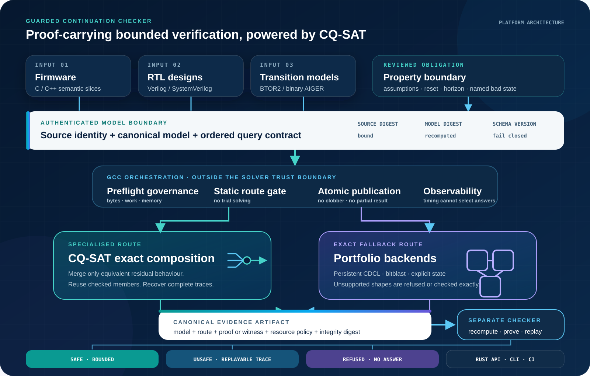

<p align="center">
  
</p>

<p align="center">
  <a href="https://github.com/kabudu/guarded-continuation-checker/actions/workflows/ci.yml?query=branch%3Amaster"></a>
  <a href="https://crates.io/crates/guarded-continuation-checker"></a>
  <a href="https://docs.rs/guarded-continuation-checker"></a>
  <a href="https://github.com/kabudu/guarded-continuation-checker/blob/master/Cargo.toml"></a>
  <a href="https://github.com/kabudu/guarded-continuation-checker/blob/master/LICENSE"></a>
  <a href="https://www.guardedcontinuation.org"></a>
</p>

# Guarded Continuation Checker

**Guarded Continuation Checker, powered by CQ-SAT**, is an evaluation-ready,
proof-carrying bounded verification platform for embedded firmware and RTL.

GCC authenticates a bounded model and reviewed obligation, governs the complete
workload before solving, and returns one of three explicit outcomes:

- `SAFE`: no violation exists inside the declared bounded model;
- `UNSAFE`: a shortest counterexample is returned for replay; or
- `REFUSED`: a policy, resource or input boundary was exceeded, so no logical
  answer is claimed.

CQ-SAT is GCC's exact continuation-quotient engine. A static structural gate
uses it only inside its validated regime. Supported cases outside that regime
remain on an exact portfolio backend.

## Status

GCC is an **evaluation-ready research prototype**. It is not yet a
production-qualified or certified verification product, a general-purpose
replacement for CDCL SAT solvers, or evidence that P = NP.

The production candidate currently supports bounded firmware and RTL safety
checking through firmware CLI contract v2 and RTL artifact schema v4. Research
interfaces remain available in the repository but are excluded from that
support promise.

Read the exact boundaries before evaluation:

- [production support profile](docs/PRODUCTION_SUPPORT_PROFILE_V1.md);
- [production-readiness gap register](docs/PRODUCTION_READINESS_GAP.md);
- [novelty gap register](docs/NOVELTY_GAP.md); and
- [security policy and threat model](SECURITY.md).

## How it works

<p align="center">
  <a href="docs/ARCHITECTURE.md">
    
  </a>
</p>

The producer and checker are separated by a canonical evidence boundary. The
checker binds the original source or model, the complete query, the selected
route and its result. Resource refusal never becomes a safety answer.

See [architecture and trust boundary](docs/ARCHITECTURE.md) for the complete
system model.

## Quick start

GCC requires Rust 1.97 or newer. RTL synthesis workflows also require Yosys.

```sh
git clone https://github.com/kabudu/guarded-continuation-checker.git
cd guarded-continuation-checker
cargo build --release --locked
cargo test --locked
```

The executable is:

```text
target/release/guarded-continuation-checker
```

### Run the infusion-pump firmware safety gate

The bundled product example starts from SystemVerilog, synthesises an AIGER
model in an isolated staging directory, checks the bounded safety property and
publishes a source-bound evidence bundle:

```sh
./target/release/guarded-continuation-checker \
  firmware-rtl-safety-gate \
  examples/products/infusion-pump/rtl/safe-controller.sv \
  infusion_pump_controller 100 target/firmware-safety
```

Validate the completed bundle before retention or downstream processing:

```sh
./target/release/guarded-continuation-checker \
  firmware-artifact-validate target/firmware-safety
```

Exit status `0` means bounded safe, `1` means a violation was found, and `2`
means the input or tool failed. The example demonstrates integration mechanics,
not medical-device certification. See the
[infusion-pump walkthrough](examples/products/infusion-pump/README.md).

### Verify an AIGER model directly

```sh
./target/release/guarded-continuation-checker \
  verify-cq-aiger examples/aiger/counter-overflow-4.aag \
  137 10 200000 results/local-aiger-counter.csv \
  results/local-aiger-counter-safety.txt
```

GCC supports bounded original five-field ASCII `aag` and binary `aig` safety
models. Input-driven or wider models route directly to exact CDCL when they do
not satisfy CQ-SAT's static gate.

## Supported product surface

The profiled production-candidate binary is built with:

```sh
cargo build --release --locked --features production-firmware
```

It exposes only:

- production and firmware capability discovery;
- single-file, multi-file, configured and constrained RTL safety gates; and
- evidence-bundle validation.

It rejects predicate, event-contract, BTOR2, revision, controller, MTBDD,
counterfactual, causal-analysis and benchmark commands before dispatch. Those
are research surfaces, not silently supported product capabilities.

The authoritative command list, version semantics and release gates are in the
[production support profile](docs/PRODUCTION_SUPPORT_PROFILE_V1.md).

## Evidence and containment

Completed firmware runs publish deterministic source snapshots, synthesis
inputs and logs, the bounded model, signal map, report, metrics, provenance and
SHA-256-bound manifest.

Linux is the supported production-evaluation host. Its hostile-RTL profile
enforces process-tree termination, time, output-file and address-space limits.
macOS remains supported for development but does not claim hard memory
containment.

SHA-256 detects changes relative to a trusted manifest; it is not a signature.
Review [RTL artifact schema v4](docs/ARTIFACT_SCHEMA_V4.md) and the
[isolation profile](docs/ISOLATION_PROFILE_V1.md) before processing untrusted
RTL.

## Evaluation

Self-service evaluators can select their own firmware or RTL designs, follow
the repository procedures and report only outcome and suitability:

- [design-partner brief](docs/DESIGN_PARTNER_BRIEF.md);
- [Linux evaluation bundle](docs/LINUX_EVALUATION_BUNDLE_V1.md);
- [pilot intake template](docs/PILOT_INTAKE_TEMPLATE.md);
- [outcome report template](docs/OUTCOME_REPORT_TEMPLATE.md); and
- [external evidence protocol](docs/EXTERNAL_EVIDENCE_PROTOCOL.md).

Independent acceptance remains a release gate. Repository examples and hosted
CI runs do not substitute for external evaluation.

## Research

The repository retains experimental mechanisms, closest baselines, negative
results and retractions. Recent compiled-firmware work includes:

- a [source-bound MMIO-to-RTL certificate](docs/OPENTITAN_PWM_MMIO_RTL_MAPPING_V1.md)
  that composes exact compiled-firmware behavior with independently rebuilt
  RTL members;
- a [dense decode graph](docs/ZEPHYR_SIFIVE_GPIO_DENSE_QUALIFICATION_V1.md)
  reproduced on pinned public Zephyr firmware across arm64 and Linux x86-64;
  and
- an [OpenSBI successor-index replay](docs/MMIO_SUCCESSOR_INDEX_REPLAY_V1.md)
  retained as a negative result after it missed the frozen improvement gate.

These results narrow the next experiments. They do not alter the supported
product profile or create a production claim.

See the [documentation map](docs/README.md), [findings](docs/FINDINGS.md) and
[research roadmap](docs/FIRMWARE_ROBOTICS_RESEARCH_ROADMAP.md) for the complete
record.

## Repository layout

- `src`: library, checker, CLI and research backends.
- `examples/products`: product-shaped evaluation examples.
- `examples`: executable verification and research probes.
- `corpus`: pinned public firmware and RTL inputs.
- `docs`: contracts, architecture, qualification evidence and research.
- `results`: curated machine-readable evidence supporting bounded claims.
- `scripts`: reproduction, qualification and release tooling.

## Project resources

- [Documentation map](docs/README.md)
- [Website](https://www.guardedcontinuation.org)
- [Rust API documentation](https://docs.rs/guarded-continuation-checker)
- [Operations](docs/OPERATIONS.md)
- [Reproducibility](docs/REPRODUCIBILITY.md)
- [Contributing](CONTRIBUTING.md)
- [Brand and naming](docs/BRAND.md)

## License

Licensed under the Apache License 2.0. See [LICENSE](LICENSE).

## Citation

See [CITATION.cff](CITATION.cff).
